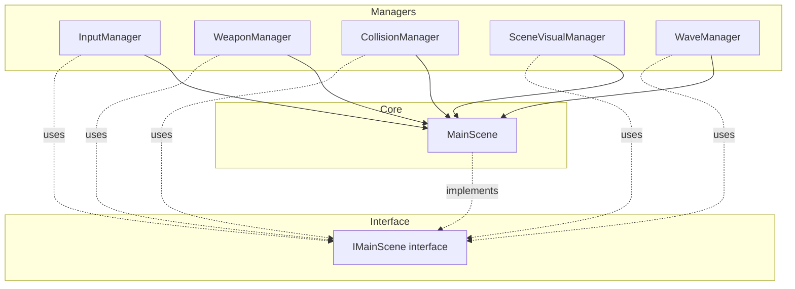

# Kringsringen: Arkitektur & Systemflyt

Denne guiden beskriver spillets modulariserte arkitektur, hvor "Manager-mønsteret" brukes til å dekomponere den tidligere massive `main.ts`-filen.

## 🏛️ Manager-mønsteret

For å redusere kompleksitet og forbedre testbarhet, er spillets kjerne-logikk delt inn i spesialiserte managere. `MainScene` fungerer som en orkestrator som delegerer spesifikke oppgaver.

### Sentrale Managere i `src/game/`

| Manager | Ansvar |
| :--- | :--- |
| `InputManager` | Håndtering av tastatur- og museinput, inkludert dash og våpenbytte. |
| `WeaponManager` | Styring av spillerens våpenarsenal, prosjektil-spawning og cooldowns. |
| `ClassAbilityManager` | Spesialiserte klasse-evner (Whirlwind, Phantom Volley, Arcane Cascade, Resonanspuls). |
| `PlayerStatsManager` | Derivering av alle spiller-stats fra upgrade-nivåer i registry. Kalkulerer HP, skade, fart, rustning, crit, etc. |
| `PlayerCombatManager` | Skadeinntak, rustning, invincibility frames, knockback og dødsdeteksjon. |
| `BuffManager` | Håndtering av buffs/debuffs med kategoriinndeling, stat-modifikatorer og varighet. Integrert med UI-lag. |
| `CollisionManager` | Definisjon av kollisjons-lag og håndtering av "overlaps" (Phaser Arcade Physics). |
| `SceneVisualManager` | Kamera-effekter (shake, flash), belysning og partikkel-emitters. |
| `WaveManager` | Fiende-spawning, bølge-logikk, nivå-progresjon og boss-trigger. |
| `ObjectPoolManager` | Gjenbrukbar pool for damage text, blod VFX, eksplosjon sprites — reduserer GC-press. |
| `SpatialHashGrid` | Rask fiende-nærhetssøk for kollisjonsdeteksjon (performance-kritisk). |
| `WeatherManager` | Regn- og tåke-partikkeleffekter per level-tema. |
| `AmbientParticleManager` | Ildfluer, løv, embers — ambient VFX basert på level-tema. |
| `ParagonAbilityManager` | Paragon-exclusive abilities (E/F/Q hotkeys) unlocked at P2/P4/P6. |
| `AchievementManager` | Tracks gameplay achievements across 5 categories (combat, progression, economy, exploration, skill). |
| `SaveManager` | Persistens av meta-progresjon, Paragon profiler og "in-run" tilstand (multi-tier localStorage). |
| `AudioManager` | Global orkestrering av BGM, BGS og asynkron loading av SFX-varianter. |
| `WaveEventManager` | Tilfeldige bølge-hendelser (BLODMÅNE, MYNTSTORM, KJEDEREAKSJON osv.) som aktiveres ved start av bølger. Hvert event har en activate()-funksjon som returnerer en cleanup-callback. |
| `ShrineManager` | Spawner helligsteder (40% sjanse per bølge), sjekker spillernærhet, appliserer pakt-mods via registry og håndterer HP-drain fra forbannelser. Se `docs/shrine-system.md`. |
| `NetworkPacketHandler` | Multiplayer-pakke serialisering/deserialisering via BinaryPacker (kun i multiplayer-modus). |

## 🔗 `IMainScene` interfacet

For å unngå sirkulære avhengigheter og sikre type-sikkerhet, kommuniserer managere med `MainScene` gjennom `IMainScene`-interfacet. Dette definerer de nødvendige egenskapene og metodene managere trenger tilgang til (f.eks. `physics`, `registry`, `player`).

## 🛠️ Spill-løkken (Update Loop)

`MainScene.update()` er holdt minimalistisk. Den kaller kun `update()` på managere som trenger det:

1.  **`Movement & Input`**: `InputManager` beregner spiller-vektorer.
2.  **`Logic`**: `WeaponManager` sjekker angreps-tilstand.
3.  **`Physics`**: Phaser håndterer kollisjoner via `CollisionManager` sitt oppsett.
4.  **`Visuals`**: `SceneVisualManager` oppdaterer dynamisk lys og kamera-vignett.

---

## 🌟 Paragon & Cloud Save Architecture

### Paragon Progression System
Se [PARAGON_DESIGN.md](./PARAGON_DESIGN.md) for full dokumentasjon av:
- Multi-character system (6 slots)
- Paragon level scaling (1.4× enemy HP per tier)
- Ascension flow (beat level 10 → Paragon +1)
- Death penalty (10% coin loss, no permadeath)

### Firebase Integration
Se [CLOUD_SAVE_ARCHITECTURE.md](./CLOUD_SAVE_ARCHITECTURE.md) for:
- Authentication (Google + Email/Password)
- Firestore sync strategy (offline-first, last-write-wins)
- Conflict resolution
- Security rules

### Achievement System
Se [ACHIEVEMENT_SYSTEM.md](./ACHIEVEMENT_SYSTEM.md) for:
- 30+ achievements across 5 categories
- Real-time event tracking
- Progress bars for incremental achievements
- Toast notification system

---
*Sist oppdatert: 8. mars 2026*
